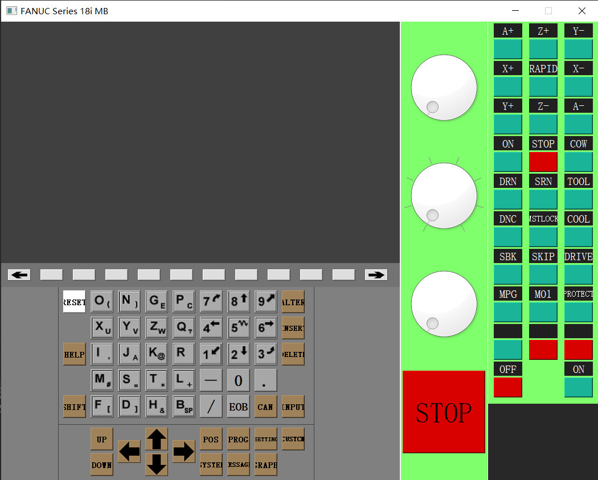
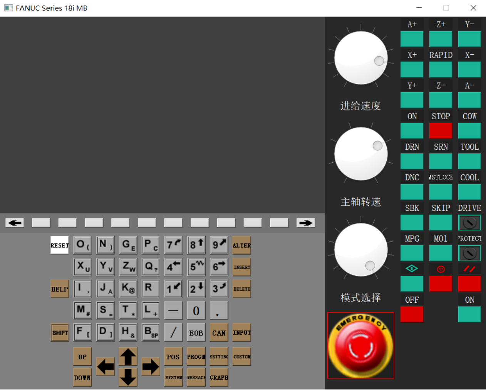
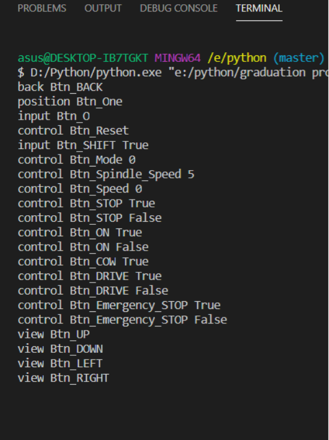
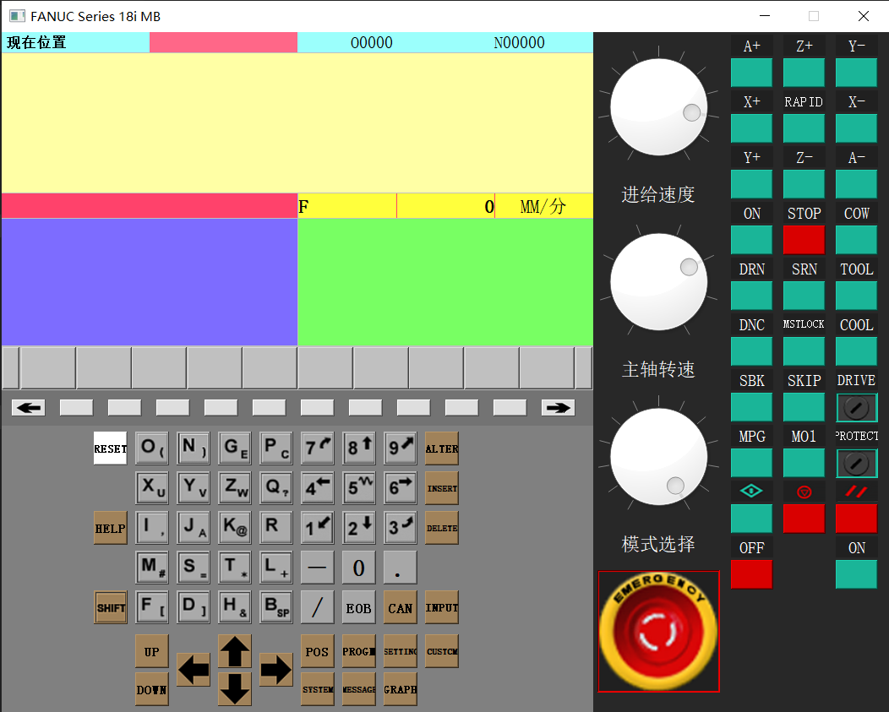
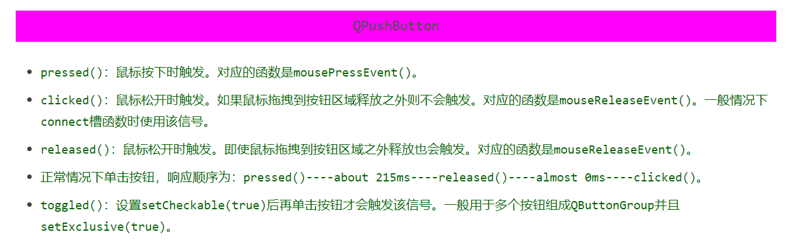
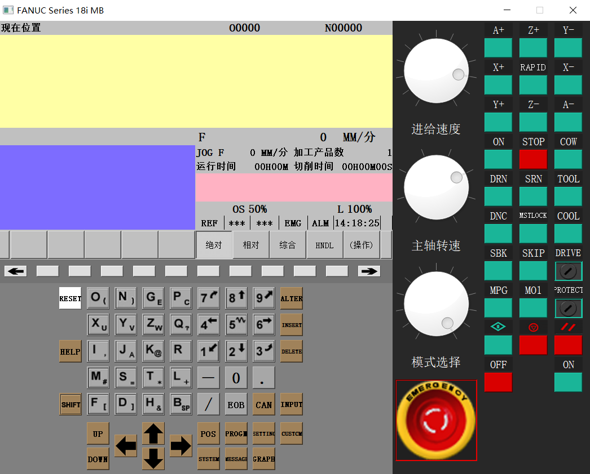
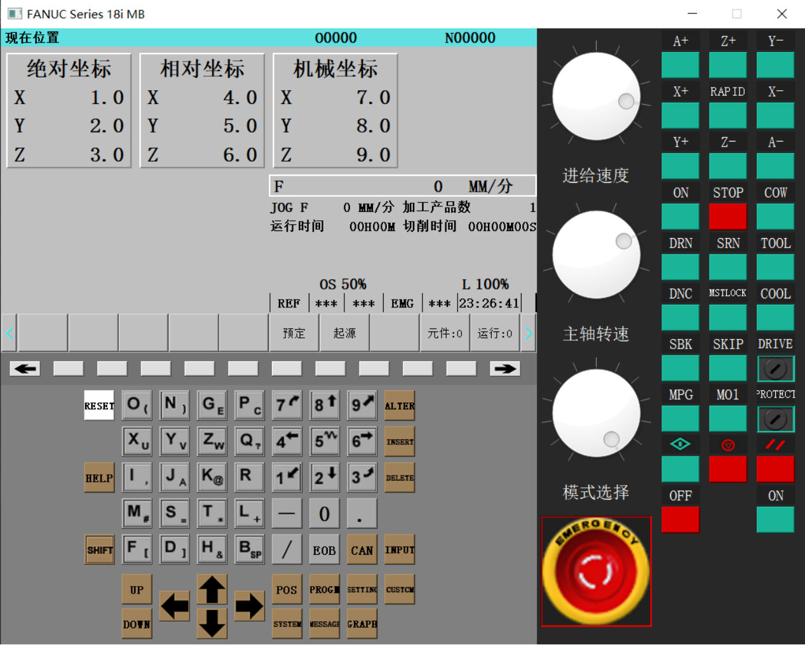
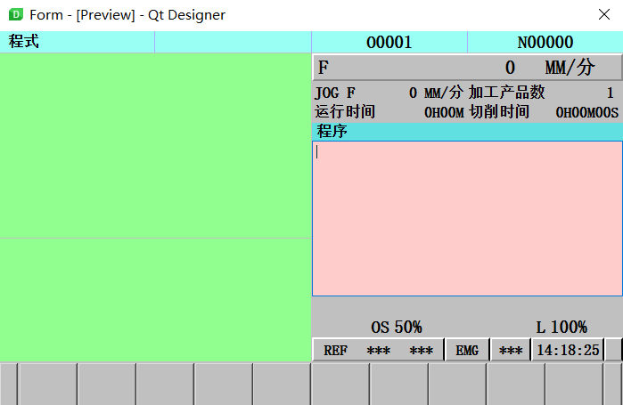
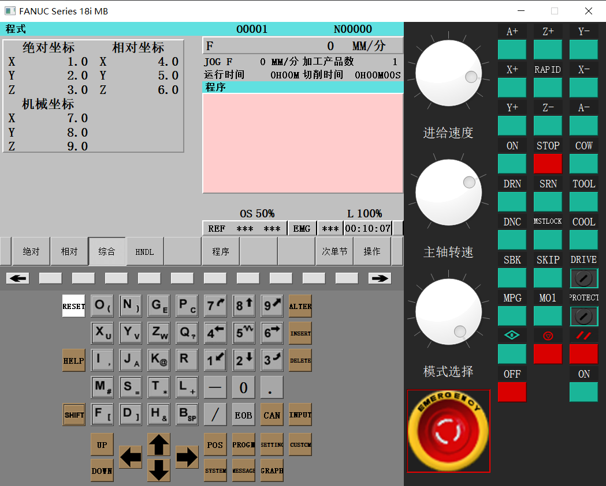
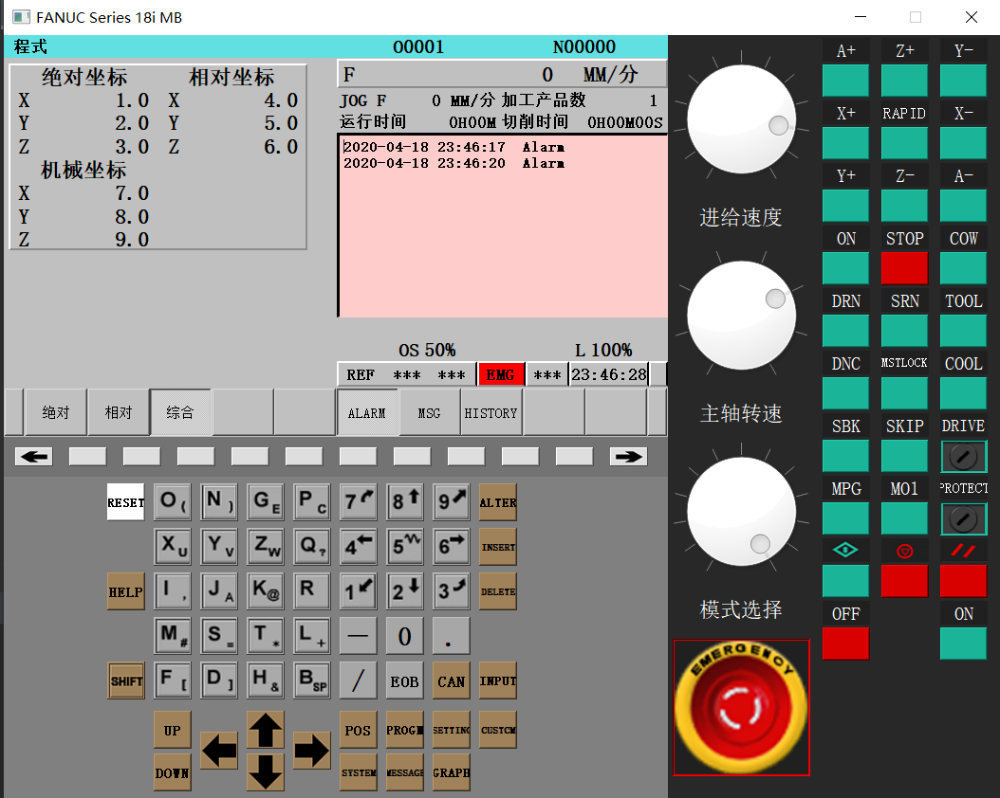

# FANUC Series 18i MB

## 数控系统界面框架

### 界面的尺寸

|-|710|340|
|-|-|-|
|425|-|-|
|40|-|-|
|340|-|-|

### 界面框架如图

1、界面基本的框架雏形已经出来了：左上角的CRT界面以及CRT下侧的软按键；左下角的输入面板部分；右侧的操作面板；

2、问题：

1> 右侧控制部分的急停按钮：样式与实际的急停按钮差别较大，且操作时的动态特效不佳。

2> 右侧的表盘控件：表盘控件一般用于展示，此处将其用作输入控件，效果不好，展示的效果较差，比如没有刻度显示，没有底部说明字符串等等。

3> 按钮控件的点击动效一般不太美观

NOTES：界面颜色会再调。

### 界面输入检测问题

PLAN：

1> 输入类的按键，设置**role**属性：input；控制类的按键包括表盘控件（可能不使用），设置**role**属性：control；对于CRT界面下方的软按键，设置**role**属性w为position，从左到右依次为1到10，另外注意两侧的软按键，设置**role**属性，back和go; 还有一类用于查看的，比如翻页，移动光标等等，认为应当设置**role**属性为view，应当与control区别，view侧重于CRT，control侧重于机床；

2> 键值部分，暂时打算创建和ObjectName相关的可遍历字典；

3> 信号与槽函数部分，自定义信号应当发送**role**属性和**ObjectName**两部分；

4> 注意RESET，ALTER，HELP键当作control类看待，在设置属性时设置为control；

5> **position**属性的信号发送时，发送position固定字符串和其值；

### 关于旋转选择开关

1> 当下，打算将其只是用QDial控件实现。存在两方面问题：一方面，刻度不能显示的问题；另一个是不能插入图片在刻度部分

2> 不打算在这个方面纠缠

### 关于控制面板的按钮设置

1> 设置checkable为True：Shift、Emergency_STOP、DRIVE（机床锁住）、PROTECT（程序保护）、RAPID（快速进给）、ON（主轴正转）、STOP（主轴停止）、COW（主轴反转）、DRN(空运行)、COOL（冷却液）、MSTLOCK（MST锁住）、SBK（单步）、SKIP（跳步）、M01（M01选择停）；

2> 不确定是否设置checkable为True：TOOL（手动换刀）、//（复位）；

3> 按钮SRN含义不清，暂不处理；并未设置手轮，MPG（手轮脉冲）按钮不处理；DNC（文件传输）暂时使用不明，目前不设置checkable；

4> 选择开关部分需要在开机时程序设置初值，暂定为：进给速度为10（100%），主轴转速为10（100%），模式选择为12（REF）；

### 界面效果

问题：

1> 旋转选择开关的问题较大，主要是刻度显示的问题。

2> SBK（单步）与SKIP（跳步）按钮我认为应当是互斥的，但是互斥设置之后，会导致check选中功能异常，表现为在一组按钮组中有且必须有一个按钮处于check状态，不能使所有按键处于uncheck状态；

### 信号测试

经过测试，所有信号都已经正常运行；

## CRT部分

### 软件上电操作之前

1> 模式介绍：EDIT（编辑模式）、MDI（手动数据输入）、JOG（手动）（打开MPG手脉模式才能使用手轮, 此时增量仍然可以控制机床）、INC（增量进给）、AUTO（自动循环）（MEM）、REF（回参考点）；

2> 急停按钮处于按下状态，DRIVE和PROTECT都处于关闭状态（改为打开）；

3> 应当编写上电前的初始化函数，PowerOffInit(), 目前遇到，参数为对象的情况(已解决)；在上电之前设置各个按钮控件的当前值，设置之前应当关闭信号连接，等当前值设置完全后再连接信号；

### 软件上电之后的初始状态

1> 机床的舱门部分不处理（暂时当作不存在），主轴STOP按钮按下，CRT界面处于POS界面，模式处于REF，进给倍率和主轴倍率都是100%；

2> 机床上电后的初始化函数，PowerOnInit(); 

3> 显示的CRT界面应当是POS界面，显示相关的坐标信息；

NOTES:

1> 发现8个轴选按钮长按是不合逻辑的问题，即当这八个按钮长按时不能正常地发送对应信号，打算单独取出来处理; 另添一个TOOL自动换刀长按问题； 

2> 自动加工状态 循环启动、循环停止

### 界面显示、事件处理、数据存储

1> 界面的按钮点击事件将会触发相应的信号，按键点击信息将会传递到CNCData类中进行处理，主要是修改可能会用于事件处理的状态信息等，然后发送信号到事件处理类来处理；

### CRT界面

1> 软按键问题，只能通过软按键设置状态，不可通过点击设置状态，可以通过重写类，截断其鼠标事件来实现; 

2> 所有内部类的父对象都应该是CRT界面对应的对象实例；

3> 认为应当在信号传递中将CRT界面所要设置的父对象传递过去；

4> 为了系统运行更稳定 认为设置相应的控制面板可以发送信号的状态位 其值True时可以发送用户点击的信号，发送过之后自动设置为False，该信号发送的信号被界面处理掉之后将由执行程序的末尾发送置位信号，将该状态设置为True；

5> 系统CRT界面已经可以实现控制面板的上电和关电操作，有一个函数并未封装，明天处理；

6> 当CRT界面创建之后应当将CNCProcess接受的数据转化为信号传递到界面中去；

7> POS界面下已经实现了绝对、相对、综合、HNDL按键的功能，操作按钮功能实现，back和go按钮实现部分功能，EMG急停显示功能实现，模式选择按钮功能实现，可以正常的切换工作模式，日期显示正常；解决关电状态下的急停按钮使用，其余按钮无效，界面内部不处理；

8> 调整back和go对应的软按键信息的存储位置 将其存储到具体的CRT界面下，不存储在CNCData中，CNCData中只保留当前界面的显示信息和点击信息；进给倍率和主轴倍率的设计完毕; 

9> 新增**role**角色为axis，为轴选信号，轴选信号的传递设计完毕, 轴选信号不传递到CRT界面，CNCProcess处理轴选信号；

10> 设计CRT的PROG界面 这个界面分为普通界面和程序界面，我认为应当拆分处理；发现加工产品数、运行时间和切削时间未处理；

11> CRT的PROG界面设计完成，接下来设计CRT中的程序界面；PROG界面分支设计结束，还存在程序显示框和输入框的业务逻辑没有实现；

12> 设计CRT的Message界面，用于显示报警信息；该界面我认为不用拆分处理，界面变化较小; 遇到QPlainText使用问题，设置光标所在行的反白效果不顺利；该部分的界面操作基本完成；

