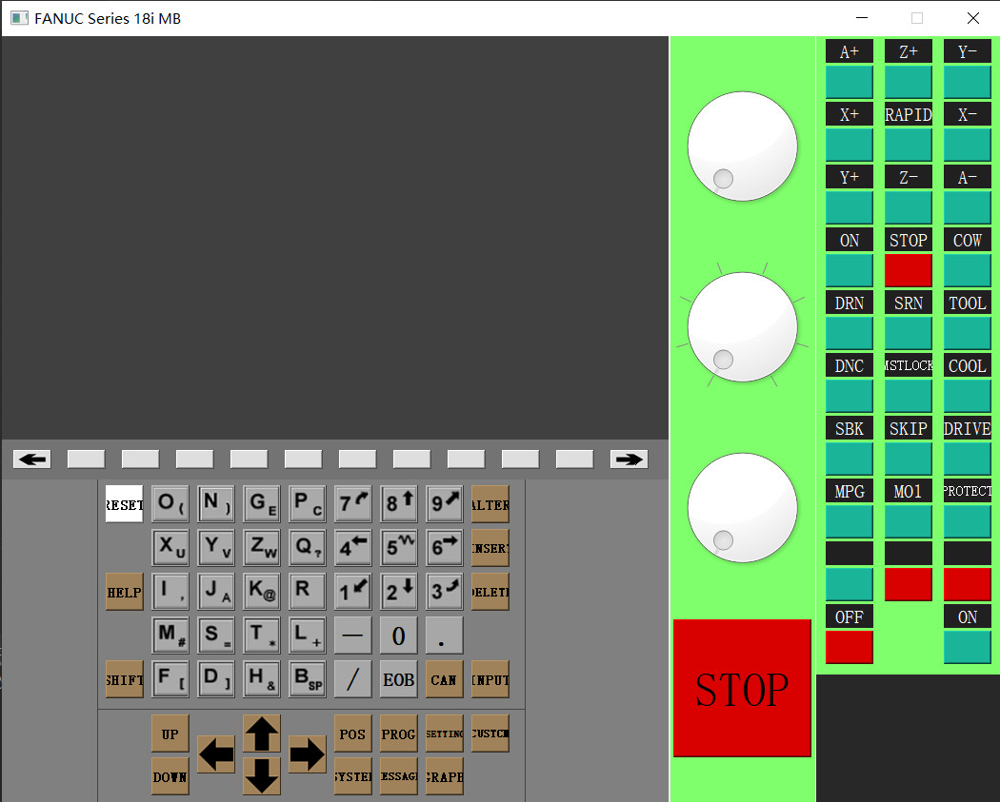

# FANUC Series 18i MB

## 1、数控系统界面框架

* 界面的尺寸

|-|710|340|
|-|-|-|
|425|-|-|
|40|-|-|
|340|-|-|

* 界面框架如图

1、界面基本的框架雏形已经出来了：左上角的CRT界面以及CRT下侧的软按键；左下角的输入面板部分；右侧的操作面板；

2、问题：

    1> 右侧控制部分的急停按钮：样式与实际的急停按钮差别较大，且操作时的动态特效不佳。

    2> 右侧的表盘控件：表盘控件一般用于展示，此处将其用作输入控件，效果不好，展示的效果较差，比如没有刻度显示，没有底部说明字符串等等。

    3> 按钮控件的点击动效一般不太美观

NOTES：界面颜色会再调。

